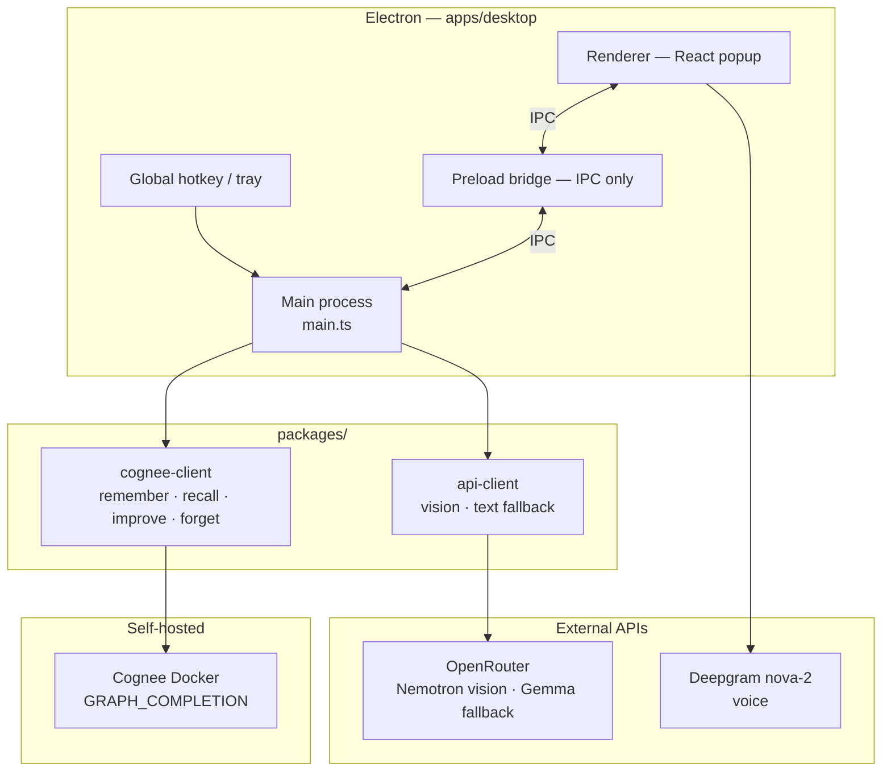

# FelixAI

<div align="center">
  <a href="LINK_TO_YOUR_YOUTUBE_VIDEO_OR_LOOM">
    
  </a>
  <h1>An AI Companion That Doesn't Forget</h1>
  <p>
    <b>Powered by <b>Cognee</b> · Self-hosted graph memory</b>
  </p>
  <p>
    <a href="https://github.com/KumarNirupam1/FelixAI/issues">Report Bug</a> ·
    <a href="https://github.com/KumarNirupam1/FelixAI/issues">Request Feature</a>
  </p>
</div>

---

## The "Why" (Our Story)

We've all been there: alt-tabbing to a chat window mid-task, pasting in the same context you pasted in yesterday, because the thing forgot everything the second you closed the tab.

**I built FelixAI because I wanted an assistant that actually lives with me, not one I have to keep re-introducing myself to.**

I went with Cognee's open-source, self-hosted version specifically — not the Cloud offering — because I wanted my data to actually stay on my machine. Everything FelixAI remembers about me lives in a knowledge graph running in Docker, right here, not in someone else's account. It also happened to be the tool behind the hackathon this was built for, which is what put it on my radar — but once I saw what it could actually do, self-hosted graph memory was the right call regardless.

Most AI assistants are forgetful by design. Every session starts from zero. FelixAI is built to do the opposite — the more you use it, the more it actually knows about you, until it's less "smart stranger you meet again every time" and more an actual companion.

## Use Cases

<div align="center">
  <p><strong>Debugging that doesn't repeat itself</strong><br>Hit the same error weeks apart — Felix recalls how you fixed it last time instead of making you solve it twice.</p>
</div>

<div align="center">
  <p><strong>Research that picks up where you left off</strong><br>Ask about something on screen today, come back days later, ask a follow-up — no re-explaining what you were even looking at.</p>
</div>

<div align="center">
  <p><strong>Remembers how you actually like to work</strong><br>Tell it once, during onboarding or mid-chat, how you like your answers or what you're focused on — it keeps answering that way instead of resetting every session.</p>
</div>

## The Cognee Experience

FelixAI doesn't treat Cognee as a bolt-on database. It's the brain of the app.

### Cognee generates the answer. It's not just storage.

This is the part that's easy to get wrong, so it's worth being explicit: a lot of "AI with memory" projects use their memory layer as a lookup table — fetch some related text, staple it into a prompt, let a separate LLM do all the actual thinking. That's not what FelixAI does.

FelixAI's `recall()` calls run with `search_type: GRAPH_COMPLETION`. That mode doesn't just do similarity search and hand back matching chunks — Cognee itself traverses the knowledge graph, reasons over the relationships between what it knows, and generates the actual answer text. **The response you see in the popup is Cognee's own output**, not a second model summarizing what Cognee found.

OpenRouter never touches the main answer. Its only two jobs are (1) describing the screen as text before the question ever reaches Cognee, and (2) stepping in with a plain LLM answer *only* if Cognee's recall comes back completely empty — which mostly happens early on, before the graph has anything relevant to work with. Every answer that actually draws on memory is Cognee reasoning over its own graph, end to end.

That's why the system prompt (`FELIX_RECALL_PROMPT`) is written the way it is — it's not instructing some downstream summarizer, it's instructing Cognee's own graph-completion model directly on how confidently to lean on what it finds: strongly if it's the same specific problem as before, lightly if it's just tangentially related, not at all if there's nothing relevant. That confidence judgment is Cognee doing the actual thinking, not decoration on top of someone else's answer.

| Pillar | How FelixAI uses it |
|---|---|
| **Remember** | Every Q&A (and onboarding answer) goes to `remember/entry` in the background — UI never blocks on it |
| **Recall** | Answers come from `recall` with `GRAPH_COMPLETION` + screen context, so memory and what's on screen merge in one query |
| **Improve** | Runs after onboarding, every 5 interactions, on feedback, and on quit — session cache syncs into the permanent graph |
| **Forget** | `forget private` wipes the sensitive dataset — chat command or Memory tab button |

Vision (OpenRouter) describes the screen. Cognee decides what you already know.

### What worked

- **Self-hosted Docker** — memory stays local, no Cognee Cloud
- **Datasets** — `main` vs `private`, with graph visualization right in the Memory tab
- **`GRAPH_COMPLETION`** — recall pulls prior fixes, preferences, and context instead of starting from zero every time
- **Fire-and-forget writes** — `remember` and `improve` never block the popup, so the assistant stays responsive even when Cognee is slow

### The "aha" moment

Cross-session recall. Quit the app, come back days later, ask about something you already solved — Cognee pulls it straight from the graph. That's the gap browser ChatGPT can't fill, and it's the whole reason this exists.

### Choosing a vision model

FelixAI is mostly screens with text — code, errors, dashboards, UI. Pick a vision model on OpenRouter that handles that well, then set `OPENROUTER_VISION_MODEL` in `apps/desktop/.env` (or change the default in `packages/api-client/src/openrouter.ts`).

**Example:** `meta-llama/llama-3.2-11b-vision-instruct` — a capable paid Meta Llama vision model, good for reading screens, UI, and dense text.

Two directions worth knowing about:

- **More privacy/security** — swap in a self-hosted vision-capable model (anything you can run locally that handles vision reasonably well) instead of routing screenshots through OpenRouter at all. This keeps the whole pipeline — screen capture, description, and memory — entirely on your own machine, not just the memory layer.
- **Better OCR/accuracy** — use a stronger paid vision model if you need sharper reads on small fonts or busy layouts. The pipeline does not care which model sits behind the API call.

### Why it feels fast, not sequential

The slow path is: screenshot → wait for vision → wait for recall → show answer. Instead:

- On hotkey — screenshot's taken, popup opens, vision starts in the background while you're still reading the UI
- While you type — vision usually finishes before you hit Enter
- On ask — if vision's still running, we race it with a 3-second cap; cached context gets reused if it's ready
- After the answer — `remember` + `improve` run in the background, so you get the reply immediately, not after the graph updates

Vision and typing overlap. Memory writes never make you wait.

## Architecture

FelixAI is an Electron desktop app with three runtime layers: a **renderer** (React popup UI), a **main process** (orchestration, secrets, screen capture), and **external services** (Cognee locally, OpenRouter + Deepgram remotely).



### Summon path (non-blocking)

1. **Hotkey** (`Ctrl+Shift+Space`) → main process opens the popup immediately.
2. **Screenshot** captured in main — image never sent to the renderer (stays in memory only).
3. **Vision** starts in the background via OpenRouter; UI shows analyzing / ready / failed.
4. Renderer receives `popup:shown` → fresh chat session for this summon.

Summon never waits on vision. Worst case: popup is instant, vision badge shows "failed", conversation still works.

### Ask path (Cognee-first)

1. User submits a question → renderer calls `ask` over IPC.
2. **`getScreenContext`** returns cached vision text, waits up to **3 seconds** on an in-flight background job, or returns empty — it does **not** start a second vision call.
3. **`buildRecallQuery`** merges screen description + question (or question alone if vision isn't ready).
4. **`cognee.recall`** with `GRAPH_COMPLETION` generates the answer from the knowledge graph.
5. If recall is empty → **OpenRouter text fallback** (Gemma) using whatever screen context exists.
6. **`rememberQA`** + periodic **`improve`** run in the background after the answer is shown.

```text
Hotkey ──► popup + screenshot ──► vision (background, best-effort)
                                        │
User asks ──► getScreenContext (≤3s) ───┤
                │                       │
                ▼                       ▼
         buildRecallQuery ──► Cognee recall ──► answer
                                    │
                              empty? ──► OpenRouter fallback
                                    │
                              fire-and-forget remember / improve
```

### Vision resilience (recent design)

Vision is **optional enrichment**, not a gate on answering:

| Layer | Behavior |
|-------|----------|
| **Background vision** (`analyzeScreenInBackground`) | One attempt per summon/recapture; 15s abort; no immediate retry on connect failure |
| **`getScreenContext`** | Cache → 3s wait on in-flight job → empty string; never blocks `ask()` on a fresh vision call |
| **Cognee recall** | Works on question-only queries when the graph has relevant memory |
| **Text fallback** | Only when recall returns empty; needs screen text to be useful |

**Why this is a good tradeoff:** OpenRouter outages or slow networks no longer stall `ask()` for 10–20+ seconds. Memory-backed answers (the core product) keep working. The cost: screen-specific questions with no memory match and no vision text may get weaker answers until the next successful summon.

**Camera re-capture:** the camera button hides the popup briefly (~350ms) so FelixAI doesn't photograph its own UI, then re-runs background vision. Conversation history is preserved.

### Security boundaries

| What | Where it lives |
|------|----------------|
| API keys (`OPENROUTER`, `DEEPGRAM`) | Main process env only — never exposed to renderer |
| Screenshots | Main process memory — not written to disk, not sent to UI |
| Knowledge graph | Self-hosted Cognee Docker |
| Voice audio | Renderer → Deepgram directly (key injected at build/dev time) |

### Monorepo packages

| Package | Role |
|---------|------|
| `apps/desktop` | Electron app — tray, hotkey, IPC, ask orchestration |
| `apps/web` | Next.js landing page |
| `packages/cognee-client` | Typed REST client for Cognee lifecycle |
| `packages/api-client` | OpenRouter vision + text fallback |
| `packages/ui` | Shared React components |

## Challenges Faced

Real hurdles, not the polished version:

**1. Day one, the graph's got nothing — and Felix feels dumb.** Fresh Cognee install, empty graph, zero nodes. You ask literally anything and recall comes back with nothing, because there's nothing *to* come back with. Felix isn't being bad at answering, there's just no memory yet — but from the outside it looks like a broken product on first launch, which is the worst possible first impression. Fix: onboarding on the very first hotkey — four quick questions (name, what you work on, what you need help with, how you like answers), each one `remember()`'d immediately. By the time you ask a real question, there are already real nodes sitting in the graph.

**2. Onboarding itself got stuck — because `remember` is slow.** Turns out `remember` can take 30–120 seconds to actually land. I had onboarding waiting on four of those sequentially, which meant staring at a loading spinner for a couple minutes on your very first launch. Not a great look. Fix: mark onboarding done the instant you finish typing, then fire all four `remember` calls plus one `improve()` in the background. You see "done" immediately, the graph catches up behind the scenes.

**3. Even with a full graph, recall still comes back empty sometimes — and that's just normal.** This one's different from #1 — the graph can have plenty in it and *still* return nothing for a specific question, because `GRAPH_COMPLETION` genuinely couldn't find a relevant path for what you just asked. This isn't a one-time bug, it's an ongoing reality of graph search — some questions just won't have a match, forever, no matter how big the graph gets. Fix: an OpenRouter fallback answers directly from the screen context whenever recall's empty, so you always get something real instead of silence — and it still gets remembered for next time, in case it comes up again.

**4. Vision latency — nobody wants to wait on summon.** If FelixAI waits for the vision model to finish describing your screen before it even shows the popup, the whole "instant assistant" feeling is gone. Fix: vision kicks off the second the popup opens, not when you hit Enter — by the time you've typed your question, it's usually already done. If it's not, `getScreenContext` races the background job with a 3-second cap and proceeds without screen text rather than starting a second blocking vision call inside `ask()`.

**5. Docker plus two separate API keys — real setup friction, no way around it.** Cognee needs its own `LLM_API_KEY` in its own `.env` for graph completion. FelixAI separately needs `OPENROUTER_API_KEY` for vision. Two different files, two different places to mess it up. Fix: spelled out clearly in setup below, plus a live health check in the header — "memory online" or "memory offline" — so you know immediately if Cognee's actually running instead of guessing.

## What It Does

- **Instant wake** — `⌘+Shift+Space` on Mac, `Ctrl+Shift+Space` on Windows/Linux — summons the popup from anywhere
- **Real screen vision** — an actual screenshot the moment you hit the hotkey, not clipboard guesswork
- **Persistent memory** — every exchange lives in a self-hosted Cognee knowledge graph
- **Voice input** — Deepgram nova-2, speak instead of typing
- **Private mode** — a dataset toggle for sensitive stuff, with one-click `forget()`

## Tech Stack

Monorepo, managed with **pnpm** + **Turborepo**.

### Desktop App (`apps/desktop`)

- **Framework**: [Electron](https://www.electronjs.org/) + [Vite](https://vitejs.dev/)
- **Frontend**: [React](https://react.dev/) + [TypeScript](https://www.typescriptlang.org/)
- **Styling**: [TailwindCSS](https://tailwindcss.com/)
- **Vision**: [OpenRouter](https://openrouter.ai/) — configurable (e.g. Llama 3.2 11B Vision)
- **Text fallback**: OpenRouter — Gemma (free tier), used when recall comes back empty
- **Voice**: [Deepgram](https://deepgram.com/) nova-2

### Memory Layer

- **[Cognee](https://github.com/topoteretes/cognee)** — self-hosted, Docker, REST API, `GRAPH_COMPLETION` search
- All four lifecycle verbs wired: `remember`, `recall`, `improve`, `forget`

### Web Landing (`apps/web`)

- **Framework**: [Next.js 15](https://nextjs.org/) (App Router)

## Getting Started

### Prerequisites

- Node.js 18+
- PNPM (`npm install -g pnpm`)
- Docker, with the [Cognee](https://github.com/topoteretes/cognee) repo cloned and running

### 1. Start Cognee

In your cloned `cognee` repo:

**Step A — set `LLM_API_KEY` in Cognee's `.env`.**

**Step B — edit `docker-compose.yml` before building the image.**  
Do this *first*; changing compose after the image is built may not apply auth settings correctly.

> **Important — FelixAI expects auth disabled on local Cognee.**  
> FelixAI is a single-user desktop companion and talks to Cognee over plain REST with no auth headers. Add these to the **`environment:`** block of the Cognee service in **`docker-compose.yml`** (not only in a mounted `.env` — that file alone is not always picked up at import time):

```yaml
environment:
  # Single-user local companion: inject auth posture into process env
  - ENABLE_BACKEND_ACCESS_CONTROL=false
  - REQUIRE_AUTHENTICATION=false
  - LLM_API_KEY=${LLM_API_KEY}   # your existing key — keep this too
```

**Step C — build and start** (only after Step B):

```bash
docker compose up -d --build
curl http://localhost:8000/health   # expect healthy
```

Without those two flags, Cognee may reject FelixAI's `remember` / `recall` / `improve` calls even when the container is up and `LLM_API_KEY` is set. If you already built without them, edit `docker-compose.yml` and run `docker compose up -d --build` again.

> **Tip:** Docker Desktop must be running. If FelixAI still shows **memory offline** in the header, open a terminal in your Cognee repo, run `docker compose up -d` once, then launch the desktop app again — it should flip to **memory online**.

### 2. Clone and install FelixAI

```bash
git clone https://github.com/KumarNirupam1/FelixAI
cd FelixAI
pnpm install
```

### 3. Environment variables

```bash
cp apps/desktop/.env.example apps/desktop/.env
```

**Required** (in `apps/desktop/.env`):

- `OPENROUTER_API_KEY` — vision + text fallback, from [OpenRouter](https://openrouter.ai/keys)
- `DEEPGRAM_API_KEY` — voice input, from [Deepgram](https://console.deepgram.com/)
- `COGNEE_URL` — defaults to `http://localhost:8000`

### Running it

```bash
pnpm install    # once at repo root
pnpm dev       # desktop app
pnpm dev:web   # landing page
```

Press **`⌘+Shift+Space`** on Mac or **`Ctrl+Shift+Space`** on Windows/Linux anywhere to summon FelixAI.

### First launch — onboarding

The **first time** you hit the hotkey, FelixAI opens a short setup flow instead of taking a screenshot. After that, every summon works normally (screenshot + vision + chat).

| Step | What you see |
|------|----------------|
| **Welcome** | Intro screen — click through to start |
| **4 questions** | Name, what you work on, what you need help with, how you like answers |
| **Done** | Chat unlocks — you're ready to ask about your screen |

The four questions (defined in `apps/desktop/electron/services/onboarding.ts`):

1. What should I call you?
2. What are you usually working on?
3. What kind of things do you want help with most?
4. How do you like your answers — quick and to the point, or more detailed and thorough?

Each answer is sent to Cognee via `remember/entry` in the **background** — the UI marks setup complete immediately so you're not waiting on slow graph writes. An `improve()` run follows to sync session data into the permanent graph.

Completion is stored locally at `%APPDATA%/FelixAI/onboarding.json` (Windows). Until that file exists, `ask()` returns a prompt to finish setup first.

## Project Structure

```text
FelixAI/
├── apps/
│   ├── desktop/                 Electron app — the product
│   │   ├── electron/            main process: tray, hotkey, screenshot, IPC, ask orchestration
│   │   └── src/                 renderer: chat popup, memory view, onboarding
│   └── web/                     Next.js landing page
├── packages/
│   ├── cognee-client/           typed REST client — remember/recall/improve/forget
│   ├── api-client/               OpenRouter vision + text fallback
│   └── ui/                      shared React primitives
├── turbo.json
└── package.json
```

## Demo Checklist

1. Complete onboarding on first hotkey
2. Ask about your screen → answer combines vision + memory
3. `remember this: …` → check the Memory tab
4. Quit, relaunch, ask about the earlier session → cross-session recall
5. Mark something private → Memory tab → Forget private → confirm it's gone
6. Voice input via the mic button
7. Memory tab → open the Cognee graph in browser

## Privacy

Screenshots happen only on hotkey — never continuously. FelixAI does not store screenshots on disk.

### What stays local

| Data | Location |
|------|----------|
| Knowledge graph (Q&A, preferences) | Self-hosted Cognee in Docker on your machine |
| Onboarding and app settings | `%APPDATA%/FelixAI/` (Windows) |

### What leaves your machine

| Data | Service | When |
|------|---------|------|
| Screenshot (as part of the API request) | OpenRouter vision | Each hotkey summon, to produce a text description |
| Question + screen text | OpenRouter text fallback (Gemma) | Only when Cognee recall returns empty |
| Voice audio | Deepgram | When you use the mic |

Memory is self-hosted. Vision and voice are not — the free OpenRouter tier may log prompts and outputs per their terms. Use private mode and `forget private` for sensitive exchanges, and avoid confidential screens on the free vision endpoint.

## Hackathon Context

- **Event**: WeMakeDevs × Cognee Hackathon — "The Hangover Part AI"
- **Track**: Best Use of Open Source (fully self-hosted Cognee, no Cloud)
- **AI tooling disclosure**: Planning and implementation assistance from Claude, via Cursor, per hackathon rules. Architecture, Cognee integration, and UI were built with AI pair-programming; product decisions and demo flow are mine.

## The Team

- **Kumar Nirupam** - [GitHub](https://github.com/KumarNirupam1) - solo participant

---

<div align="center">
  Made by <b>Kumar Nirupam</b>
</div>